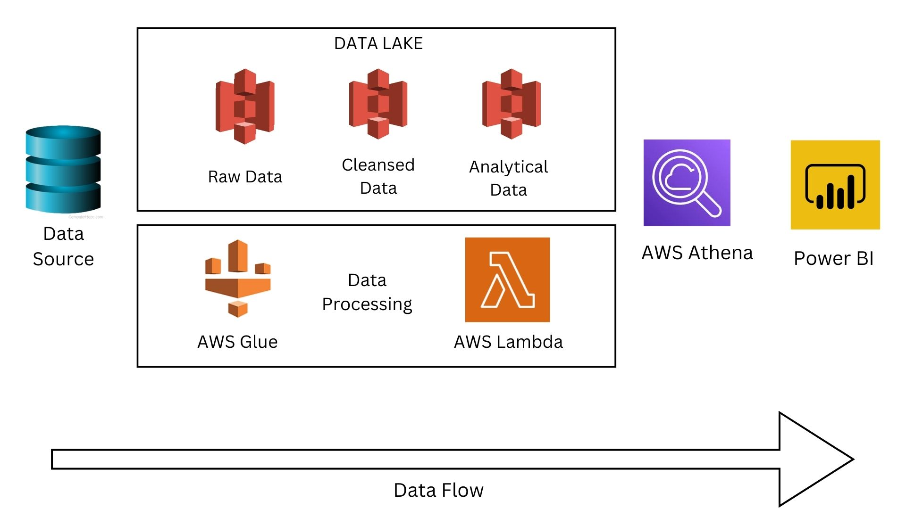
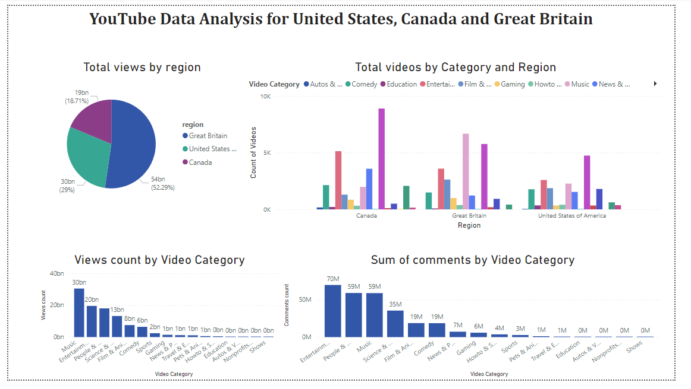

# DE-YouTube-Analysis

## Overview
This project aims to securely manage, streamline, and perform analysis on the structured and semi-structured YouTube videos data based on the video categories and the region.

## Use case of this analysis
1. This analysis can be used to determine which categories are performing well in certain region of the world. Companies can display ads on these category videos to promote their product and get good returns.
2. A person trying to start its YouTube journey can check the upcoming performing video category in its region and perform well in short period of time.
## Architecture

## Solution

### Tools used
1. AWS S3
2. AWS Glue Catalog
3. AWS Lambda function
4. AWS Athena
5. Kaggle
6. Power BI
### Steps
1. Creating an IAM role for development with limited permission for privacy
2. Importing data from YouTube API data from Kaggle to S3
3. Restructing data through AWS Lambda
4. Creating AWS Athena tables through Glue Catalog
5. Performing ETL job through AWS Glue and storing the data in final athena table
6. Connecting Athena table to Power BI.
7. Performing analysis on Power BI
## Analysis
[Power BI Workspace](https://app.powerbi.com/groups/me/reports/3af6d8a1-ff53-4314-a99c-89f3d0533275/ReportSection)!

